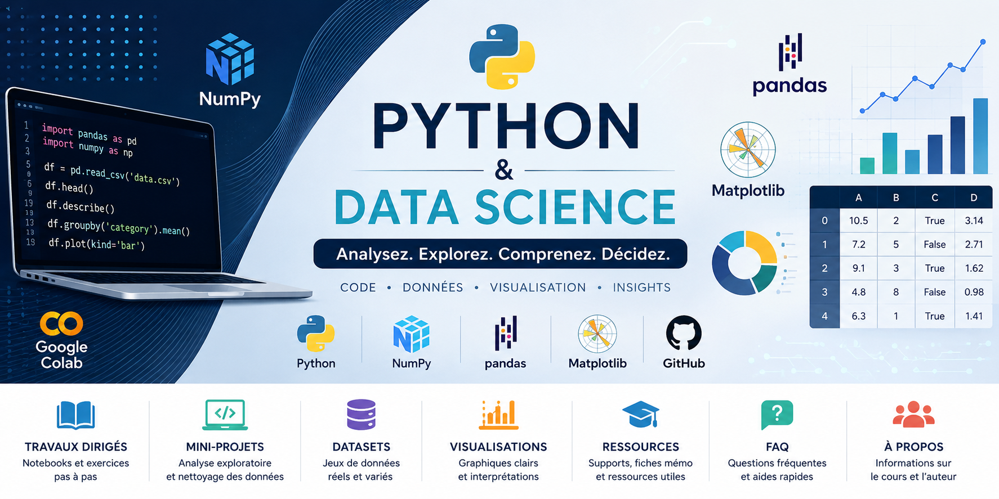
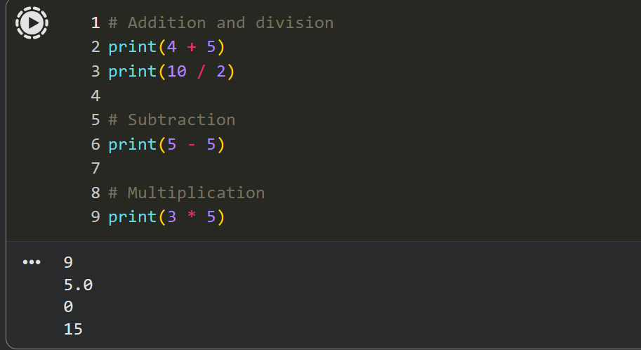

<!-- ========================================================= -->
<!--                  PYTHON & DATA SCIENCE                    -->
<!-- ========================================================= -->

<p align="center">



</p>

# 🐍 Python & Data Science

<p align="center">


</p>

---

> [!NOTE]
>
> **Dernière mise à jour :** Juillet 2026
>
> 🚧 Cette plateforme est actuellement en cours de construction.
> Les ressources pédagogiques seront publiées progressivement tout au long du semestre.

---

# 📖 Présentation

Bienvenue sur le dépôt officiel du cours **Python & Data Science**.

Ce dépôt accompagne les travaux dirigés de **Licence 3** et **Master 1 Économie**.

L'objectif est de proposer un environnement d'apprentissage moderne, reproductible et entièrement basé sur le Web.

Aucune installation locale de Python n'est nécessaire.

Les travaux pratiques sont réalisés avec **Google Colab**, les projets sont versionnés avec **GitHub** et certains exercices sont progressivement vérifiés automatiquement grâce à **GitHub Actions**.

---

<p align="center">



</p>

---

# 🚀 Accès rapide

| Ressource | Description |
|-----------|-------------|
| 📚 [Travaux dirigés](assignments/) | Supports de TD, notebooks et exercices |
| 📊 [Mini-projets](projects/) | Mini-projets et consignes |
| 📂 [Jeux de données](datasets/) | Jeux de données utilisés pendant les TD |
| 📖 [Documentation](docs/) | Documentation de la plateforme |
| 📁 [Ressources](resources/) | Fiches mémo et ressources complémentaires |
| ❓ [FAQ](faq/) | Questions fréquentes |

---

# 📈 Progression du dépôt

| Ressource | Statut |
|-----------|:------:|
| README | ✅ |
| TD1 | ✅ |
| TD2 | ⏳ |
| TD3 | ⏳ |
| TD4 | ⏳ |
| TD5 | ⏳ |
| TD6 | ⏳ |
| Mini-projet 1 | ⏳ |
| TD7 | ⏳ |
| TD8 | ⏳ |
| Mini-projet 2 | ⏳ |
| TD9 | ⏳ |
| TD10 | ⏳ |
| Documentation | ⏳ |
| Jeux de données | ⏳ |
| FAQ | ⏳ |

**Légende**

- ✅ Disponible
- 🚧 En cours
- ⏳ À venir

---

# 📋 Feuilles de présence

| TD | QR Code | Lien direct |
|-----|:-------:|-------------|
| TD1 |  | [Feuille de présence TD1](https://forms.gle/QY9o9Pjzp7vwyqex6) |
| TD2 | ⏳ | — |
| TD3 | ⏳ | — |
| TD4 | ⏳ | — |
| TD5 | ⏳ | — |
| TD6 | ⏳ | — |
| TD7 | ⏳ | — |
| TD8 | ⏳ | — |
| TD9 | ⏳ | — |
| TD10 | ⏳ | — |

---

# 📑 Sommaire

- [📖 Présentation](#-présentation)
- [🎯 Objectifs pédagogiques](#-objectifs-pédagogiques)
- [🌍 Pourquoi ce cours ?](#-pourquoi-ce-cours)
- [📋 Prérequis](#-prérequis)
- [📚 Organisation du cours](#-organisation-du-cours)
- [📅 Programme](#-programme)
- [🔄 Déroulement d'une séance](#-déroulement-dune-séance)
- [🛠️ Environnement de travail](#️-environnement-de-travail)
- [🤝 Contribution](#-contribution)
- [📜 Licence](#-licence)

---

# 🎯 Objectifs pédagogiques

À l'issue du cours, vous serez capable de :

- développer des programmes en Python ;
- écrire des fonctions réutilisables ;
- utiliser NumPy pour le calcul scientifique ;
- manipuler des données avec Pandas ;
- produire des graphiques avec Matplotlib ;
- utiliser Google Colab pour développer des notebooks interactifs ;
- utiliser Git et GitHub pour gérer vos projets ;
- réaliser une analyse complète d'un jeu de données.

---

# 🌍 Pourquoi ce cours ?

Python est aujourd'hui l'un des langages les plus utilisés dans les domaines de :

- l'économie ;
- la finance ;
- l'assurance ;
- la data science ;
- l'intelligence artificielle ;
- la recherche.

Le cours privilégie une approche pratique basée sur des notebooks interactifs, des études de cas et des mini-projets afin de développer des compétences directement mobilisables dans un contexte professionnel.

---

# 📋 Prérequis

Pour suivre le cours, vous aurez uniquement besoin de :

- un compte GitHub ;
- un compte Google ;
- un navigateur Web récent (Chrome, Edge ou Firefox).

Aucune installation de Python n'est nécessaire.

---

# 📚 Organisation du cours

Le cours est composé de :

- **9 Travaux Dirigés**
- **2 Mini-projets**
- **1 Test de présence au début de chaque séance**
- **1 Quiz à la fin de chaque séance**
- **Travail personnel en autonomie**
- **Projets réalisés en binôme ou trinôme**

Chaque séance dure **2 heures**.

---

# 📅 Programme

| Séance | Sujet |
|--------|------|
| TD1 | Introduction à Git |
| TD2 | Introduction à GitHub |
| TD3 | Les bases de Python |
| TD4 | Les fonctions, modules et NumPy |
| TD5 | Matplotlib, dictionnaires et Pandas |
| TD6 | Logique, flux de contrôle, filtrage et boucles |
| MP1 | **Mini-projet 1 – Analyse exploratoire** |
| TD7 | Pandas : agrégation et transformation des données |
| TD8 | Pandas : filtrage des données et opérations conditionnelles |
| MP2 | **Mini-projet 2 – Nettoyage et transformation des données** |
| TD9 | Pandas : fusion de données et jointures |
| TD10 | Séries temporelles |

---

# 🔄 Déroulement d'une séance

Chaque séance suit le même workflow.

```text
               Début du TD
                    │
                    ▼
                GitHub
          (accès au dépôt du cours)
                    │
                    ▼
     Correction du TD précédent      ← à partir du TD2
                    │
                    ▼
      Google Forms (présence)        ← tous les TD (10 pts)
                    │
                    ▼
          Open in Google Colab
                    │
                    ▼
      Réalisation des exercices      ← tous les TD (20 pts)
                    │
                    ▼
   Sauvegarde sur GitHub             ← à partir du TD2
   (branche dev_tdXX)
                    │
                    ▼
       GitHub Actions                ← à partir du TD3
  (tests auto sur dev_tdXX)
                    │
                    ▼
   Pull Request → main               ← à partir du TD3
   + review par un collègue
   (reviewer obligatoire)
                    │
                    ▼
        Google Forms (quiz)          ← à partir du TD3 (10 pts)
                    │
                    ▼
               Fin du TD
```

---

# 🎓 Évaluation

| Élément | Points | À partir de |
|---------|:------:|:-----------:|
| Feuille de présence | 10 pts | TD1 |
| Notebook (exercices Colab) | 20 pts | TD1 |
| Quiz de fin de séance | 10 pts | TD3 |

---

# 🛠️ Environnement de travail

| Outil | Utilisation |
|--------|-------------|
| Python | Programmation |
| Google Colab | Développement des notebooks |
| Git | Gestion de versions |
| GitHub | Hébergement des projets |
| GitHub Actions | Vérification automatique |
| NumPy | Calcul scientifique |
| Pandas | Manipulation des données |
| Matplotlib | Visualisation |
| Google Forms | Présence et quiz |

## Compatibilité

| Plateforme | Support |
|------------|:-------:|
| Windows 11 | ✅ |
| macOS | ✅ |
| Linux | ✅ |
| Google Chrome | ✅ |
| Microsoft Edge | ✅ |
| Mozilla Firefox | ✅ |

---

# 📂 Structure du dépôt

```text
python-datascience
│
├── assignments/
├── datasets/
├── docs/
├── faq/
├── projects/
├── resources/
└── assets/
```

---

# 🤝 Contribution

Les étudiants sont encouragés à :

- signaler une erreur ;
- proposer une amélioration ;
- poser leurs questions pendant les séances.

---

# 📜 Licence

Ce projet est distribué sous licence **MIT**.

---

<p align="center">

⭐ Si ce dépôt vous est utile, n'hésitez pas à lui attribuer une étoile.

</p>
